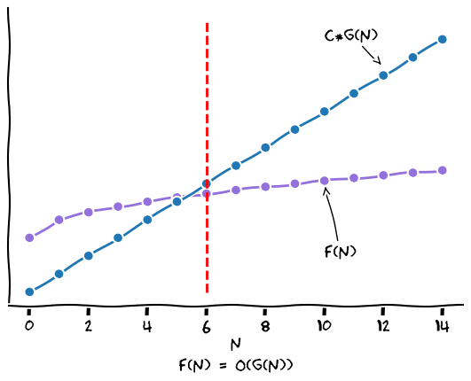

# Notación O

## Introducción

La notación O (también llamada notación *Big-O* o *notación asintótica*) es una herramienta matemática que nos permite analizar algoritmos sin preocuparnos de detalles muy puntuales que afectan el tiempo de ejecución de un programa como los siguientes:

- El hardware en el que se está ejecutando el programa.

- Otros procesos corriendo en la computadora mientras se está ejecutando el programa.

- El lenguaje de programación y las habilidades del codificador usando dicho lenguaje.

- El compilador o intérprete que se está usando.

Sin embargo, la notación O es lo bastante buena para comparar algoritmos a partir de simple ***pseudocódigo***.

## Teoría matemática

**Definición matemática**

Sean $f, g: \mathbb{N}\rightarrow\mathbb{R}$. Entonces:

1. $f$ **es de orden a lo más** $g$, denotado por $f(n)= O(g(n))$, si y sólo si, existen $c\in\mathbb{R}^+$ y $\color{#F00}k\in\mathbb{N}$ tales que $\color{#84F}f(n) \leq \color{#24F}c\cdot g(n)$ para todo $\color{#F72}n\geq k$.

2. $f$ **es de orden al menos** $g$, denotado por $f(n) = \Omega (g(n))$, si y sólo si, existen $c\in\mathbb{R}^+$ y $k\in\mathbb{N}$ tales que $c\cdot g(n) \leq f(n)$ para todo $n\geq k$.

3. $f$ **es de orden** $g$, denotado por $f(n) = \Theta (g(n))$, si y sólo si, existen $c_1, c_2\in\mathbb{R}^+$ y $k\in\mathbb{N}$ tales que $c_1\cdot g(n) \leq f(n) \leq c_2\cdot g(n)$ para todo $n\geq k$.

**¿Qué nos quiere decir la definición 1 en palabras simples?**

$f(n)=O(g(n))$ $\text{si y sólo si}$ $\color{#F00}\text{existe un momento}$  $\color{#F72}\text{a partir del cuál}$  $\color{#84F}f\text{ está acotada superiormente}$ $\color{#24F}\text{por algún mútiplo de }g$

## Aplicación al análisis de algoritmos

**¿Para qué nos sirve la notación O?**

- Para comparar dos algoritmos que resuelven un mismo problema: Por ejemplo, el algoritmo de ordenamiento **Merge sort** tiene complejidad $O(n\log n)$ mientras que **Insertion sort** tiene complejidad $O(n^2)$.

- Para comparar dos problemas computacionales: Está demostrado que no se puede diseñar un algoritmo de ordenamiento basado en comparar elementos que tenga una complejidad mejor que $O(n\log n)$, mientras que fácilmente podemos diseñar un algoritmo para hallar el máximo de un arreglo que tenga complejidad $O(n)$. Por lo que podríamos decir que hallar el máximo de un arreglo es más *"fácil"* computacionalmente que ordenarlo por medio de comparaciones.

ToDo:

- Teoremas

    - Equiv $O$ y $\Omega$ con $\Theta$.
    - Se desparecen constantes
    - Polinomios son $O(n^k)$.
    - Polinomios **NO** son $O(n^{k-1})$.

- Relación con Algoritmos
    - Operaciones básicas

- Correspondencia con la realidad
