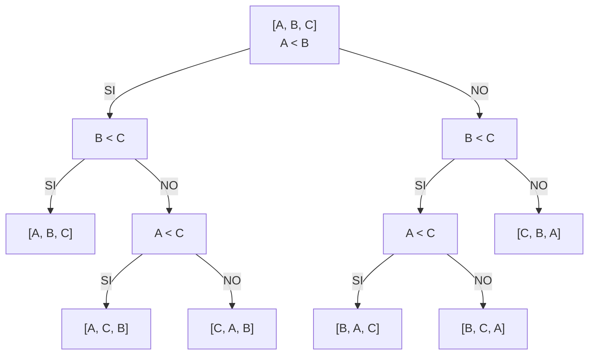
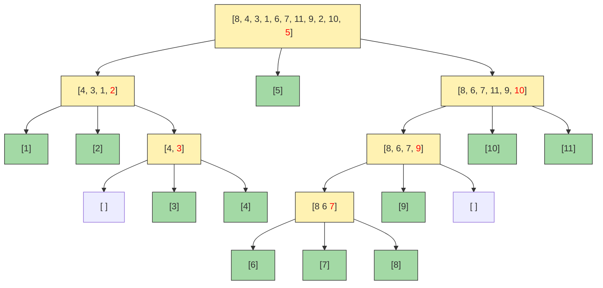

# Ordenamiento

Existen 2 tipos de ordenamiento: Ordenamientos comparativos y no comparativos.

Los ordenamientos comparativos se basan en comparar dos elementos entre sí. Algunos ejemplos de ordenamientos comparativos son Bubblesort, Selección, Inserción, Mergesort, Quicksort.

**¿Cuánto es lo mínimo que le toma a un algoritmo de ordenamiento comparativo ordenar?**

A continuación se muestra el árbol de comparaciones de 3 elementos:

La cantidad de comparaciones se relaciona con la altura de dicho árbol. Para un arreglo de $n$ elementos, el árbol tendrá $n!$ hojas. Si $C$ es la cantidad de nodos, entonces la altura del árbol es $h=\lfloor\log_2 (C) \rfloor$. En el último nivel de un árbol binario tenemos a lo más $2^h$. Entonces $2^h \geq n!$, así que $h\geq\log_2(n!)$, entonces $h = \Omega(\log(n!))=\Omega(n \log n)$

___
**Proposición**:

$$\Omega(n\log n) = \Omega(\log(n!))$$

Demostración:

$$\log(n!) = \log(1\cdot2\cdot3\cdots n)=\\\log(1)+\log(2)+\cdots+\log(\frac{n}{2})+\log(\frac{n}{2}+1)+\cdots+\log(n)>\\ \log(\frac{n}{2}+1)+\cdots+\log(n)>\\\log( n/2)+\cdots+\log(n/2) = \frac{n}{2}\log(n/2)=\frac{n}{2}\cdot(\log(n)-log(2))=\Omega(n\log n)$$

___

Por lo tanto no puede existir un algoritmo de ordenamiento comparativo que sea mejor que $O(n\log n)$

### Quicksort

# Referencias

[2024-04-08 - Teórica - Ordenamientos no Comparativos - Counting Sort](https://youtu.be/v0DGQ8tYcis?si=3bIl_SPF5pI-mXPb). YouTube: Algoritmos Fiuba Curso Buchwald