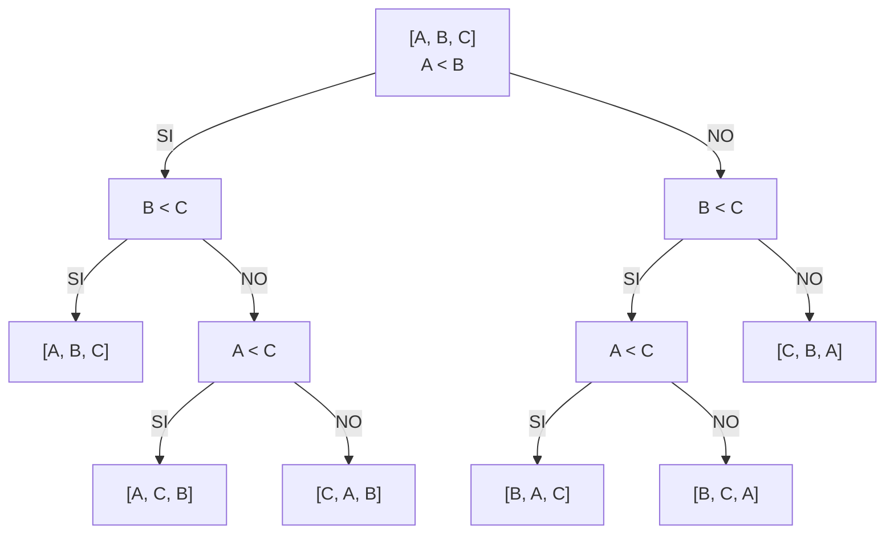

# Ordenamiento

```mermaid
graph TD

    root["[A, B, C]<br/>A < B"]

    root -->|SI| b_lt_c["B < C"]
    root -->|NO| b_lt_c2["B < C"]

    %% Left branch
    b_lt_c -->|SI| abc["[A, B, C]"]
    b_lt_c -->|NO| a_lt_c["A < C"]

    a_lt_c -->|SI| acb["[A, C, B]"]
    a_lt_c -->|NO| cab["[C, A, B]"]

    %% Right branch
    b_lt_c2 -->|SI| a_lt_c2["A < C"]
    b_lt_c2 -->|NO| cba["[C, B, A]"]

    a_lt_c2 -->|SI| bac["[B, A, C]"]
    a_lt_c2 -->|NO| bca["[B, C, A]"]

```